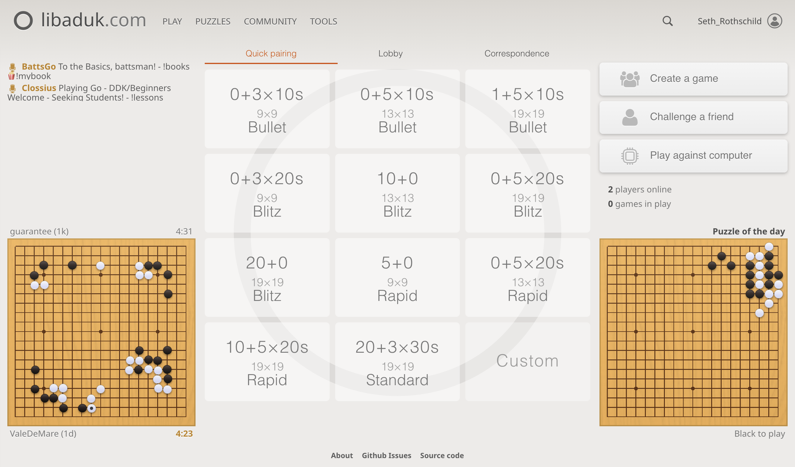
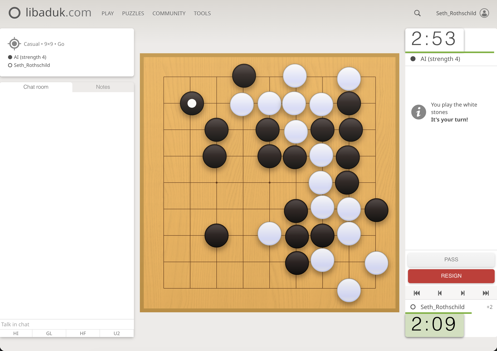

# libaduk.com

A Go game platform that looks and feels like [Lichess](https://lichess.org). Here we've taken the css from [lila](https://github.com/lichess-org/lila) the open-source Scala/Play server behind Lichess and applied the css to a Svelte app.

This code is a prototype and has made heavy use of LLMs to get it started. That being said, it's mostly functional and feels pretty nice to use. Demo site is up at [libaduk.com](https://libaduk.com). If there are things that would improve your experience with the site, just let me know.



## Provenance

Large parts of both code and inspiration have been taken from [lila](https://github.com/lichess-org/lila), and this repository happily preserves its AGPL license. Go [support that project](https://lichess.org/patron)!

The game board, board logic, and board feel are heavily inspired by [Sabaki](https://github.com/SabakiHQ) and uses Sabaki components where possible.

The client-side AI uses KataGo ONNX models served by [Kaya](https://github.com/kaya-go/kaya), running in-browser via ONNX Runtime Web.



## Roadmap

I'm not interested in replacing OGS or further partitioning the Go community. There are no major new features planned at this time since the site is sufficient for my Go playing needs. That being said, if there's functionality you're specifically interested in please reach out.


## Development

### Setup

First install [Node.js](https://nodejs.org/) and [MongoDB](https://www.mongodb.com/docs/manual/installation/). Then:

```sh
npm install

# Start MongoDB (in a separate terminal)
mongod --dbpath data/mongo

# Start the dev server
npm run dev
```

### Other commands

```sh
npm run storybook   # component explorer
npm run test        # unit + component tests
npm run test:e2e:ui # interactive e2e test runner
npm run build       # production build
npm start           # run production server
```
